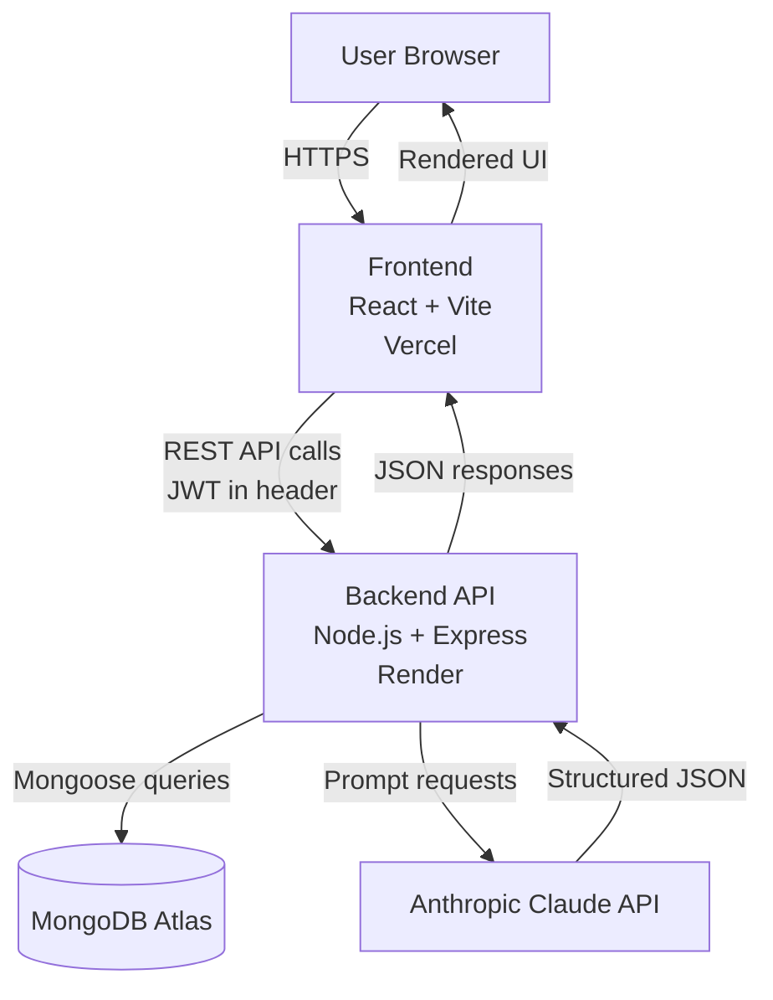
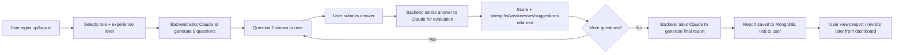
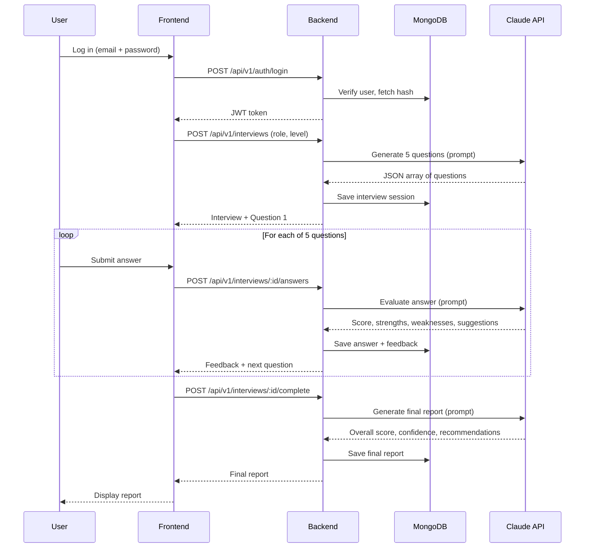

# ARCHITECTURE.md — AI Mock Interview Coach

## Tech Stack

| Layer | Choice | Rationale |
|---|---|---|
| Frontend | React (Vite) + Tailwind CSS | Fast dev server, large ecosystem, Tailwind speeds up responsive UI |
| Backend | Node.js + Express | Same language as frontend; fast to build in 10 days; mature auth/JWT ecosystem |
| Database | MongoDB Atlas (free tier) | Schema-flexible, ideal for nested/variable interview report documents; free 512MB tier sufficient for MVP |
| Authentication | Self-built: bcrypt + JWT | Matches approved scope (email+password); no vendor lock-in, no cost |
| AI Model/API | Anthropic Claude API | Strong structured JSON output for questions, evaluations, and reports |
| Hosting (Frontend) | Vercel (free tier) | Zero-config React/Vite deploys, free SSL |
| Hosting (Backend) | Render (free tier) | Free Node hosting, auto-deploy from GitHub (cold start ~30-50s accepted for MVP) |
| Other | dotenv, Zod, React Router | Lightweight, standard, free |

## Component Diagram

Frontend never talks to the DB or Claude directly — all traffic proxies through the backend, keeping credentials and API keys server-side only.

## Data Flow

## Request Lifecycle

## AI Interaction Detail

Three distinct Claude calls, each with a strict "respond only in JSON" system prompt for deterministic parsing:

| Call | Input | Output |
|---|---|---|
| Question generation | Role + experience level | Array of 5 questions (text + difficulty) |
| Per-answer evaluation | Question + answer + role/level context | `{score, strengths[], weaknesses[], suggestions[]}` |
| Final report generation | All 5 Q&A pairs + evaluations | `{overallScore, confidenceLevel, recommendations[]}` |

*Recurring-pattern analysis is deferred to v1.1 per approved scope trade-off (see PRD.md).*

## External Services

- **Anthropic Claude API** — question generation, evaluation, report generation
- **MongoDB Atlas** — persisted users + interview sessions/reports
- **Vercel** — frontend hosting
- **Render** — backend hosting
