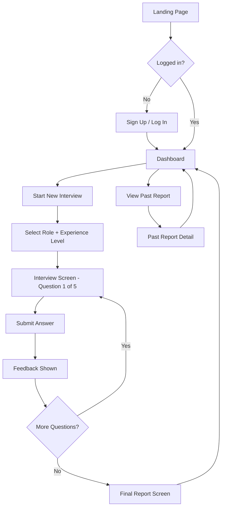
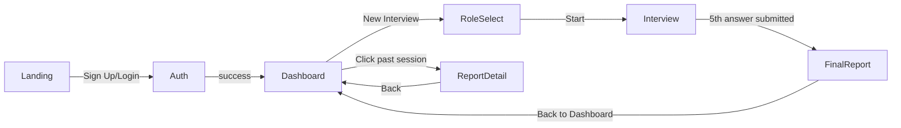

# UI-WIREFRAMES.md — AI Mock Interview Coach

## User Flow Diagram



## Screen Inventory

| Screen | Purpose | Justification |
|---|---|---|
| Landing | Marketing/entry point | Explains value before signup |
| Sign Up / Log In | Auth | Required to save reports |
| Dashboard | Hub — new interview or history | Central navigation; only way to revisit past reports |
| Role + Level Selection | Configure interview | Directly required by PRD |
| Interview Screen | Ask question, capture answer, show feedback | Core product loop |
| Final Report | Overall score, confidence, recommendations | Core deliverable |
| Past Report Detail | Revisit saved report | Required by auth/persistence scope |

No screen exists without a direct line to an approved user story.

## Screen Flow / Navigation Map



## Low-Fidelity Wireframes

### Dashboard
```
┌─────────────────────────────┐
│  AI Mock Interview Coach    │
│                    [Logout] │
├─────────────────────────────┤
│  [ + Start New Interview ]  │
│                             │
│  Past Interviews:           │
│  ┌───────────────────────┐ │
│  │ Frontend Dev · Mid     │ │
│  │ Score: 82  Jul 20      │ │
│  └───────────────────────┘ │
│  ┌───────────────────────┐ │
│  │ Backend Dev · Senior   │ │
│  │ Score: 74  Jul 18      │ │
│  └───────────────────────┘ │
└─────────────────────────────┘
```

### Role + Experience Selection
```
┌─────────────────────────────┐
│  ← Back                     │
│                             │
│  Select Target Role         │
│  [ Dropdown: Frontend Dev ▾]│
│                             │
│  Select Experience Level    │
│  ( ) Entry  (•) Mid  ( ) Sr │
│                             │
│       [ Start Interview ]   │
└─────────────────────────────┘
```

### Interview Screen
```
┌─────────────────────────────┐
│  Question 3 of 5            │
│  ●●●○○  (progress)          │
│                             │
│  "Tell me about a time..."  │
│                             │
│  ┌───────────────────────┐ │
│  │ [ Your answer here ]  │ │
│  │                       │ │
│  └───────────────────────┘ │
│         [ Submit Answer ]   │
└─────────────────────────────┘
```

### Feedback (after submit, before next question)
```
┌─────────────────────────────┐
│  Score: 78/100              │
│                             │
│  ✅ Strengths                │
│  • Clear structure           │
│                             │
│  ⚠️ Weaknesses               │
│  • Lacked specific metrics    │
│                             │
│  💡 Suggestions              │
│  • Use the STAR method       │
│                             │
│        [ Next Question ]    │
└─────────────────────────────┘
```

### Final Report
```
┌─────────────────────────────┐
│  Interview Complete 🎉      │
│                             │
│  Overall Score: 82/100      │
│  Confidence Level: High     │
│                             │
│  Recommendations:           │
│  • Practice quantifying...  │
│  • Work on conciseness...   │
│                             │
│      [ Back to Dashboard ]  │
└─────────────────────────────┘
```

## Navigation Rules
- No back-navigation out of an active interview mid-flow without a confirmation dialog ("Leaving will lose this session's progress") — sessions aren't resumable across a partial abandon in v1.0
- Dashboard is the single hub; every screen has exactly one path back to it
- Auth gate sits in front of Dashboard only — Landing page is public
